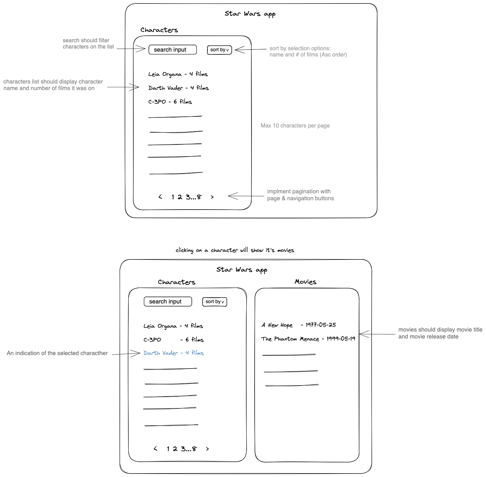

# Verbit Frontend Home Assignment

This assignment has been given to you as part of our interview process. It should take approximately 5-6 hours to complete. 

## How to do it
 - To begin, read all of the instructions on this page. 
 - Use this repository to push the code to. Start with creating a new `create-react-app` and push it as a baseline. Next, start working on the assignment (detailed below).
 - In order for us to see your progress, please push your changes roughly once an hour, even if your code is incomplete or does not build. 
 - Once you have completed the assignment: 
   - Make a final push containing working code. 
   - Edit the `README` with instructions on how to run the app.
   - Let us know you're done. 
 - Feel free to contact us in any case:
   - Omri: omri.barzilai@verbit.ai
   - Hila: hila.ben-baruch@verbit.ai

## Assignment

The assignment involves working with the Star Wars API (https://swapi.dev/). This is a simple REST API that returns information related to Star Wars movies.

Your task is to create a web application with the following features:
- The layout (roughly sketched below) has two sections:
   - **Characters List** - A list of Star Wars characters (i.e., those returned by https://swapi.dev/api/people/). Each item should display the character's name and the number of films they have appeared in.

   - **Movies List** - A list of a selected character's movies, displayed when a character is clicked in the Characters list. Each item should display the movie's title and its release date.

- Requirments:
   - The Characters list should be searchable through a search input field that will filter the list accordingly.
   - The Characters list should be sortable. The user should be able to sort by name or number of films using a selection component (the default order should be ascending).
   - The Characters list should display pagination if it contains more than 10 characters. The user should be able to navigate backwards and forwards using arrow buttons and/or by clicking on page number.
   - Clicking on a character should display their movie list on the right. The application should indicate which character is currently selected.

The page should be designed nicely, even if you are not a designer (which is fine!). It should look presentable and "nice".

## The assignment will be evaluated based on the following criteria:

- General code quality
- Project structure and architecture
- User experience

